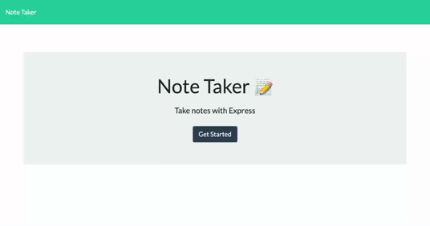
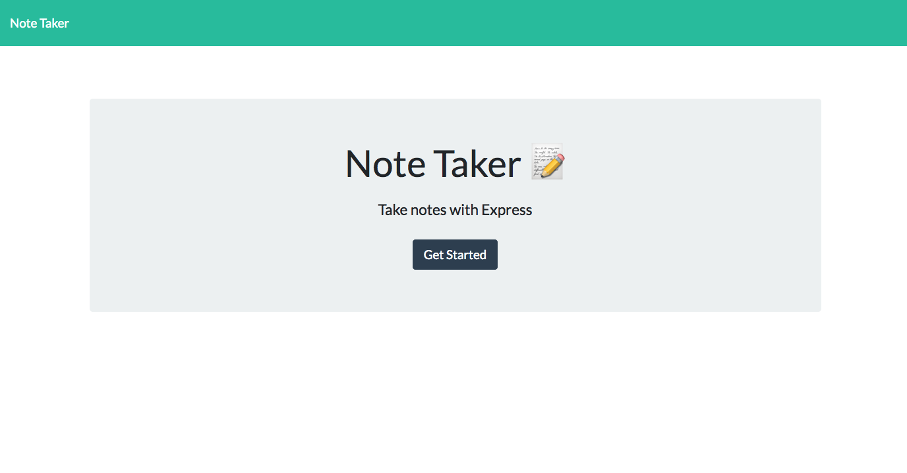
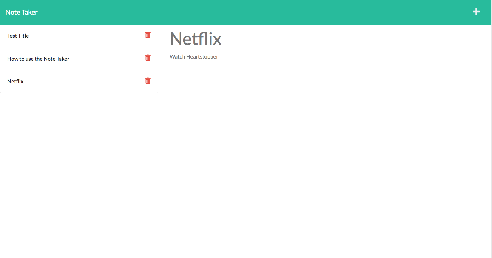

## Express.js Note Taker

A note-taking application that allows you to write, save and delete notes. The data contained in the notes is saved to a database.

## Table of Contents

* [Technologies](#technologies)
* [Installation](#installation)
* [Usage](#usage)
* [Live Demo](#live-demo)
* [Resources](#resources)
* [License](#license)

## Technologies
This applicaation was built using the following technologies and languages:
* [Node.js](https://nodejs.org/en/)
* [Express](https://expressjs.com/)
* [UUID](https://www.npmjs.com/package/uuid)
* [Bootstrap](https://getbootstrap.com/)
* [nodemon](https://nodemon.io/)
* HTML
* CSS
* JavaScript

## Installation
No installation is required for this project! Check out the [deployed application over on Heroku](https://dashboard.heroku.com/apps/dry-reaches-37181).
Alternatively, clone or fork [the express-note-taker repo](https://github.com/jazzberriess/express-note-taker) and then run `npm install` to get going on your local host.

## Usage
Create a note title and enter the text for the note, then click the save button. Data will be retained on browser refresh and will only be removed if the user chooses to delete it via the delete button.

## Live Demo

### Demonstration gif of the application deployed on Heroku:

### Screenshot of the rendered index/splash page:

### Screenshot of the rendered notes page:

## Resources
* [Express Documentation](https://expressjs.com/)
* [UUID Documentation](https://www.npmjs.com/package/uuid)
* [MDN Docs](https://developer.mozilla.org/en-US/docs/Web/JavaScript)
* [Express JS Crash Course](https://www.youtube.com/watch?v=L72fhGm1tfE)
* [Node Express Tutorial 5](https://www.youtube.com/watch?v=K9jTQPb0Xso)
* [How to read and write a JSON object to file in Node.js](https://attacomsian.com/blog/nodejs-write-json-object-to-file)
* [Stack Overflow - Can't access object property ](https://stackoverflow.com/questions/17546953/cant-access-object-property-even-though-it-shows-up-in-a-console-log)
* [MDN - HTTP Response Status Codes](https://developer.mozilla.org/en-US/docs/Web/HTTP/Status#client_error_responses)
* [Heroku documentation](https://devcenter.heroku.com/articles/getting-started-with-nodejs?singlepage=true)

## License

This project is covered under the [MIT license](https://github.com/jazzberriess/prof-readme-generator/blob/main/LICENSE)

&copy; 2022 Christi Scappatura